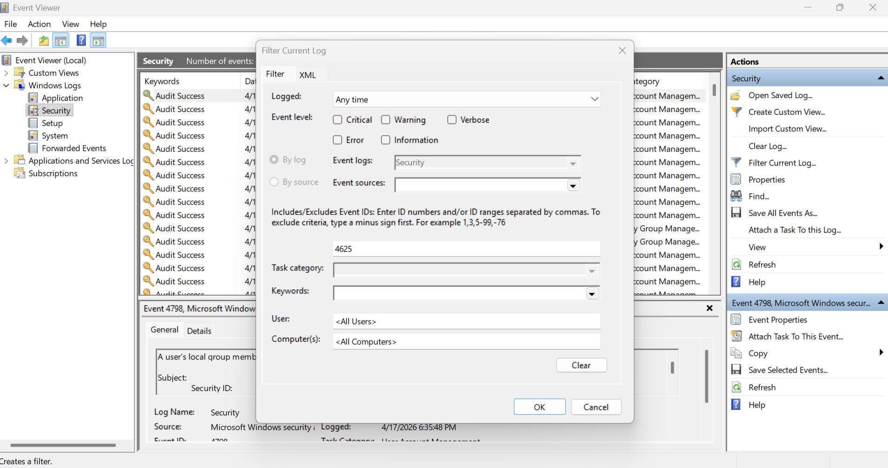
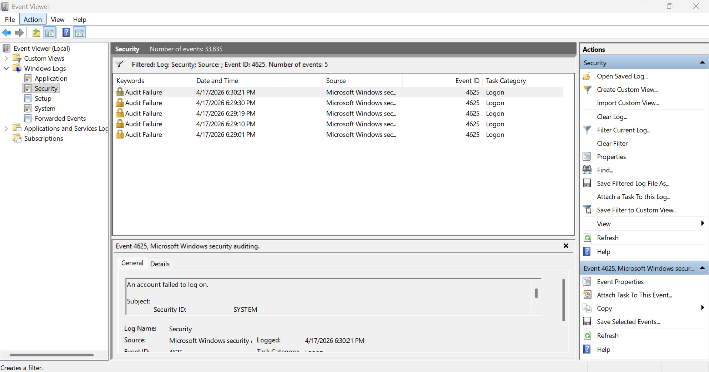
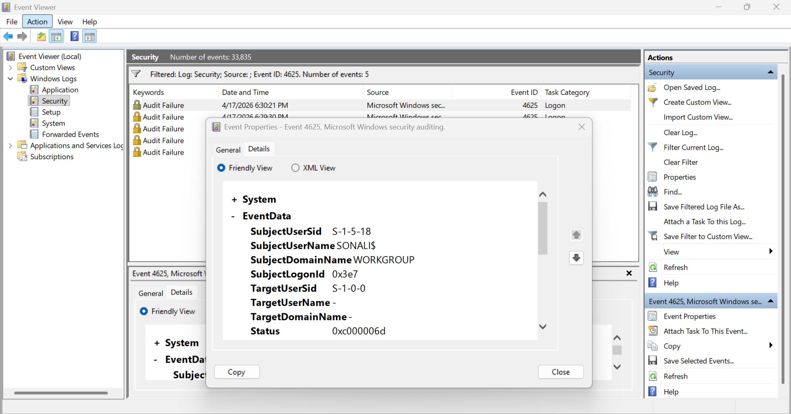

# Windows Brute Force Detection using Log Analysis

## 📌 Overview

This project demonstrates how failed authentication attempts can be detected and analyzed using Windows Security logs.

A controlled brute force scenario was simulated on a local system to understand how repeated login failures are recorded and how such patterns can indicate potential unauthorized access attempts.

---

## 🛠️ Environment

- Windows OS (Local Machine)
- Windows Event Viewer

---

## 🔍 Investigation Process

- Simulated multiple failed login attempts using incorrect credentials
- Accessed Windows Event Viewer and navigated to Security logs
- Filtered events using **Event ID 4625 (failed login attempts)**
- Examined key fields such as:
  - Account Name
  - Logon Type
  - Failure Reason
  - Timestamp
- Correlated multiple log entries to identify abnormal patterns

---

## 📊 Key Findings

- Multiple failed login attempts were observed within a short time frame
- Logon Type 2 confirmed interactive login attempts from the local system
- Failure reason indicated incorrect password usage
- Repeated authentication failures for the same system indicate abnormal login behavior

---

## 🔎 Analysis

The observed pattern of repeated failed login attempts within a short time window is consistent with brute force attack behavior.

In real-world environments, such activity may indicate an attacker attempting to gain unauthorized access by trying multiple password combinations.Although this was a controlled simulation, the detection approach remains the same for real incidents.

Further investigation would require validating source IP and login origin in a real-world environment. This activity would require further validation of source origin and correlation with additional logs in a real-world SOC environment.

---

## 🛡️ Recommended Actions

- Implement account lockout policies after multiple failed attempts
- Monitor authentication logs for repeated failures
- Configure alerts for suspicious login patterns
- Investigate source systems in case of real-world occurrences

---

## 📸 Evidence

### Filtered Logs (Event ID 4625)

### Multiple Failed Login Attempts

### Event Details

---

## 🧠 Learning Outcome

- Gained hands-on experience in analyzing Windows Security logs
- Understood how authentication failures are recorded and interpreted
- Learned to identify suspicious patterns based on frequency and timing
- Developed foundational skills required for SOC monitoring and incident investigation

---

## 🎯 Conclusion

This project demonstrates how simple log analysis can be used to detect suspicious authentication behavior.

Such techniques are fundamental in Security Operations Centers (SOC) for identifying potential threats and responding to unauthorized access attempts.

---

## ℹ️ Note
This project was performed in a controlled environment for learning purposes.
